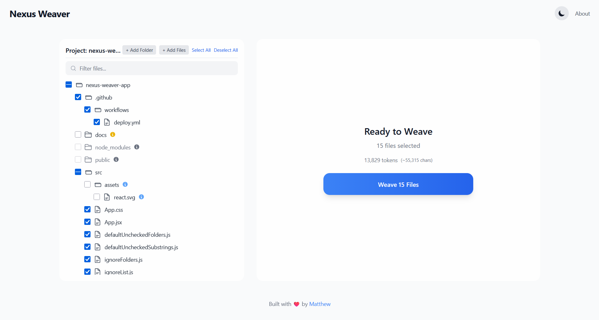

<div align="center">

# Nexus Weaver

<b>A simple tool to combine all your project files into a single text file for easy sharing with AI models.</b>
<br/><br/>
<a href="https://angryflaren.github.io/nexus-weaver/"><strong>🚀 View Live Demo</strong></a>

</div>

<br/>

## 🌐 Live Screenshot

<p align="center">
  
</p>

## 📖 About the Project

Do you need to give your project code to an AI like GPT? Copying every file is slow and boring. It is easy to miss a file.

**Nexus Weaver** fixes this problem. It is a web app that works in your browser. It helps you:
1.  Drag your project folder into the browser.
2.  See a list of all your files and choose the ones you want.
3.  Click one button to "weave" (combine) all files into one big, clean text file.

This project was made with help from an AI assistant to build a useful tool for the developer community.

**Main technologies used:**
* React.js
* Vite
* Tailwind CSS

## ✨ Key Features

* **Works in Browser**: No install needed. Your files stay on your computer. They are safe and private.
* **Drag & Drop**: Just drop your folder to start. It's very easy.
* **Smart Ignore**: It knows not to include folders like `node_modules` or `.git`. This saves you time.
* **Add More Files:** You can add new files or folders without losing your current selection.
* **File Search:** Quickly find the files you need in the tree with a search bar.
* **Token Counter:** Shows an estimated token count so you don't exceed the AI's limit.
* **Handles Images & Docs**: It can turn images and documents into text (using Base64) so they can be included.
* **Easy Output**: Copy the final text with one click, or download it as a `.txt` file.
* **Dark Mode**: Good for your eyes when you work at night.

## 🚀 How to Use

You have two ways to use Nexus Weaver.

### Option 1: Use Online (Easy Way)

Click the link below to use the app now. No setup needed.

➡️ **[https://angryflaren.github.io/nexus-weaver/](https://angryflaren.github.io/nexus-weaver/)**

### Option 2: Run on Your Computer

If you want to run the project on your own computer, follow these steps.

1.  **Clone the repository**
    ```sh
    git clone https://github.com/angryflaren/nexus-weaver.git
    ```
2.  **Go into the project folder**
    ```sh
    cd nexus-weaver
    ```
3.  **Install the necessary packages**
    ```sh
    npm install
    ```
4.  **Run the app**
    ```sh
    npm run dev
    ```
    Now, open `http://localhost:5173` (or the address it shows you) in your browser.

## ✍️ Authors

This project is made and maintained by the following person.

| Role      | Name             | Contacts                                                                                                                                                                                                                                                                                                                                                                        |
| --------- | ---------------- | ------------------------------------------------------------------------------------------------------------------------------------------------------------------------------------------------------------------------------------------------------------------------------------------------------------------------------------------------------------------------------- |
| Developer | Matthew Zhuchkov | <div style="white-space: nowrap;"><a href="mailto:matthewzhv@outlook.com" title="Contact via Outlook"></a> <a href="https://t.me/alikkuc" title="Contact via Telegram"></a></div> |

## 📜 License

This project has an MIT License. You can see the [LICENSE](LICENSE) file for more details.
